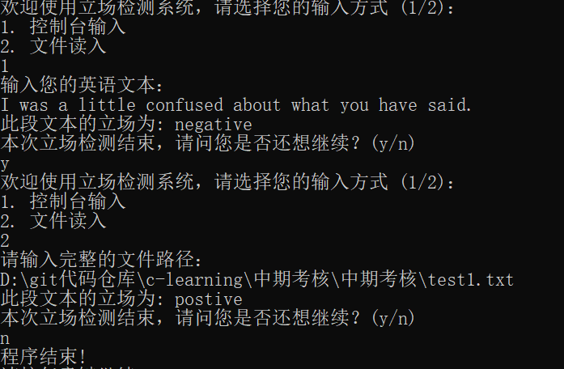

# Stance Detection System

## Introduction

This is an English stance detection system, which can determine your emotional tendency such as positive, negative and neutral.

## Function Description

**The total goal of my project is to identify the stance in your sentence.**
My project can be divided into several parts:
1. Data Loading: load sentiment lexicon, stop-word list, negative word list using **STL** early on.

2. Sentence Preprocess: remove the punctuations in your sentence and convert all letters to lowercase.

3. Tokenization: tokenize the text to words, while also remove the stop words(which means the useless words for detection) and check if there is a negative word(if there is, the stance will be reversed).

4. Stance Detection: calculate the sentiment score of words in your text according to the sentiment lexicon and analysis your stance based on the score.

## Project Structure

My project includes those parts:

* data: English sentiment lexicon, stop-word list, negative word list

* testdata: testing data which can be used for inputing

* include: my `.h` files

* src: my `.cpp` files

* CMakeLists.txt: used for building our project

* docs: contains an introduction document

## Building Method

Build the project with Visual Studio:

    mkdir build
    cd build
    cmake ..
    cmake --build .
    Debug/Detection.exe

## Usage Example

1. Choose your inputing channel: by console or from your file.

2. If by console, input your sentence(remember only in English).
If from your file, please input your file path.

3. Get your stance towards the text from the console directly.

4. Choose whether to keep using the system or not(y/n).

An Example:

